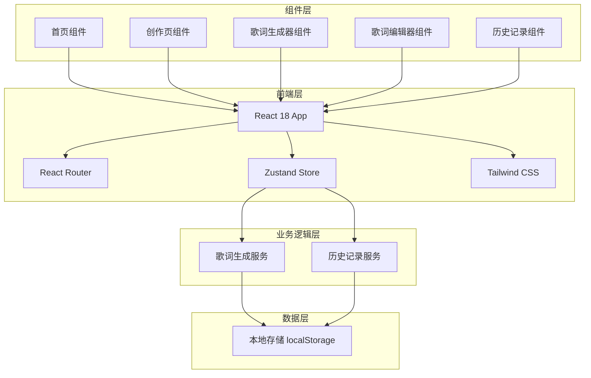

# 歌词工坊 - 技术架构文档

## 1. 架构设计



## 2. 技术栈

| 技术 | 版本 | 用途 |
|------|------|------|
| React | 18.x | UI框架 |
| TypeScript | 5.x | 类型安全 |
| Vite | 5.x | 构建工具 |
| Tailwind CSS | 3.x | 样式框架 |
| Zustand | 4.x | 状态管理 |
| React Router | 6.x | 路由管理 |
| Lucide React | 最新版 | 图标库 |

## 3. 项目结构

```
/workspace
├── src/
│   ├── components/          # 组件目录
│   │   ├── ui/             # UI基础组件
│   │   │   ├── Button.tsx
│   │   │   ├── Card.tsx
│   │   │   ├── Input.tsx
│   │   │   └── Select.tsx
│   │   ├── layout/         # 布局组件
│   │   │   └── Header.tsx
│   │   ├── home/           # 首页组件
│   │   │   ├── Hero.tsx
│   │   │   └── FeatureCard.tsx
│   │   └── creator/        # 创作页组件
│   │       ├── ParameterPanel.tsx
│   │       ├── LyricsDisplay.tsx
│   │       ├── LyricsEditor.tsx
│   │       └── HistoryDrawer.tsx
│   ├── pages/              # 页面目录
│   │   ├── Home.tsx
│   │   └── Creator.tsx
│   ├── services/           # 服务层
│   │   └── lyricsGenerator.ts
│   ├── store/              # 状态管理
│   │   └── useLyricsStore.ts
│   ├── hooks/              # 自定义Hooks
│   │   └── useLyricsHistory.ts
│   ├── types/              # 类型定义
│   │   └── index.ts
│   ├── App.tsx
│   ├── main.tsx
│   └── index.css
├── .trae/
│   └── documents/
│       ├── PRD.md
│       └── ARCHITECTURE.md
├── package.json
├── vite.config.ts
├── tailwind.config.js
├── tsconfig.json
└── README.md
```

## 4. 路由定义

| 路由 | 页面 | 描述 |
|------|------|------|
| / | Home | 首页，展示产品介绍 |
| /create | Creator | 歌词创作页面 |

## 5. 数据模型

### 5.1 歌词项 (LyricsItem)

```typescript
interface LyricsItem {
  id: string;                    // 唯一标识
  theme: string;                 // 主题
  style: LyricsStyle;            // 风格
  mood: LyricsMood;             // 情绪
  length: LyricsLength;          // 长度
  content: string;               // 歌词内容
  createdAt: number;             // 创建时间戳
  isFavorite: boolean;          // 是否收藏
}

type LyricsStyle = 'pop' | 'rock' | 'folk' | 'rap' | 'electronic' | 'ancient';
type LyricsMood = 'happy' | 'sad' | 'passionate' | 'gentle' | 'inspirational' | 'nostalgic';
type LyricsLength = 'short' | 'medium' | 'long';
```

### 5.2 生成参数 (GenerateParams)

```typescript
interface GenerateParams {
  theme: string;                 // 主题描述
  style: LyricsStyle;           // 风格
  mood: LyricsMood;             // 情绪
  length: LyricsLength;         // 长度
}
```

## 6. 核心服务

### 6.1 歌词生成服务 (lyricsGenerator.ts)

```typescript
// 核心函数签名
generateLyrics(params: GenerateParams): Promise<string>

// 服务特点
// - 使用预设歌词模板库
// - 根据风格和情绪选择合适的词汇
// - 随机组合生成多样化的歌词
// - 返回Promise模拟异步生成过程
```

### 6.2 历史记录服务

```typescript
// 基于 localStorage 实现
// Key: 'lyrics_history'
// Value: JSON stringified LyricsItem[]

// 支持操作
// - saveLyrics(item: LyricsItem): void
// - getHistory(): LyricsItem[]
// - deleteLyrics(id: string): void
// - toggleFavorite(id: string): void
```

## 7. 状态管理 (Zustand Store)

```typescript
interface LyricsStore {
  // 当前创作状态
  currentParams: GenerateParams;
  currentLyrics: string;
  isGenerating: boolean;
  
  // 操作方法
  setParams: (params: Partial<GenerateParams>) => void;
  generate: () => Promise<void>;
  clearLyrics: () => void;
}
```

## 8. 组件设计原则

1. **单一职责**：每个组件只负责一个功能模块
2. **可复用性**：通用UI组件放在 components/ui 目录
3. **Props类型化**：所有组件props使用TypeScript定义
4. **动画优先**：使用CSS动画实现过渡效果
5. **无障碍支持**：使用语义化HTML和ARIA属性
