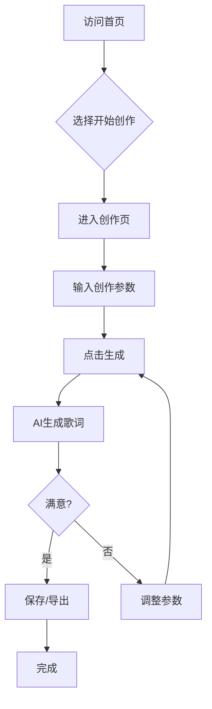

# 歌词工坊 - 产品需求文档

## 1. 产品概述

**歌词工坊** 是一款智能歌词生成平台，帮助音乐爱好者、创作者快速生成原创歌词。用户只需输入主题、风格和情绪关键词，即可获得富有意境的歌词作品。

### 核心价值
- 简化歌词创作流程，让灵感快速转化为文字
- 提供多种音乐风格支持，满足不同创作需求
- 实时保存与编辑功能，创作体验流畅自然

---

## 2. 功能模块

### 2.1 页面结构

| 页面名称 | 模块名称 | 功能描述 |
|---------|---------|---------|
| 首页 | Hero区域 | 展示产品定位，一键开始创作 |
| 首页 | 功能介绍 | 展示核心功能特点 |
| 创作页 | 创作面板 | 输入创作参数，生成歌词 |
| 创作页 | 歌词展示 | 显示生成的歌词内容 |
| 创作页 | 歌词编辑 | 支持在线编辑和调整歌词 |
| 创作页 | 历史记录 | 保存和查看历史创作 |

### 2.2 功能详情

#### 2.2.1 歌词生成器
- **主题输入**：用户输入歌词主题（如：爱情、离别、梦想）
- **风格选择**：流行、摇滚、民谣、说唱、电子、古风
- **情绪标签**：欢快、忧伤、激昂、温柔、励志、怀旧
- **歌词长度**：短篇（16句）、中篇（32句）、长篇（48句）
- **生成按钮**：一键生成歌词，显示加载动画

#### 2.2.2 歌词编辑器
- 实时编辑生成的歌词
- 支持撤销/重做操作
- 复制歌词到剪贴板
- 一键清空重新生成

#### 2.2.3 历史记录
- 自动保存每次创作
- 支持查看历史歌词
- 收藏喜欢的歌词
- 导出歌词为文本文件

---

## 3. 用户流程

### 3.1 主流程

### 3.2 用户交互流程

1. 用户进入首页，浏览功能介绍
2. 点击"开始创作"按钮进入创作页面
3. 输入歌词主题描述
4. 选择音乐风格和情绪标签
5. 设置歌词长度偏好
6. 点击"生成歌词"按钮
7. 系统显示加载动画并生成内容
8. 用户查看生成的歌词
9. 可选择编辑、重新生成或保存

---

## 4. 界面设计

### 4.1 设计风格

**设计理念：音乐律动与创意表达的融合**

- **主题色彩**：深邃紫黑 (#0d0d1a) 为主背景，搭配霓虹紫 (#8b5cf6) 和霓虹粉 (#ec4899) 作为强调色，营造音乐现场的氛围感
- **按钮风格**：圆角胶囊按钮，带有柔和的渐变发光效果
- **字体选择**：使用 "Noto Sans SC" 作为中文字体，"Outfit" 作为英文标题字体，营造现代感
- **布局风格**：卡片式布局，左右分栏创作界面
- **图标风格**：使用 Lucide Icons，保持简洁线条风格

### 4.2 页面设计

#### 首页
- **Hero区域**：渐变背景动画，中央大标题"歌词工坊"，副标题"让每一句歌词都成为你的故事"，底部CTA按钮"开始创作"
- **功能特点**：三个卡片展示"智能生成"、"多风格支持"、"即时编辑"

#### 创作页
- **左侧面板**：输入区域，主题输入框，风格选择器，情绪标签选择，长度滑块，生成按钮
- **右侧面板**：歌词展示区，带有打字机效果显示歌词，编辑工具栏，历史记录抽屉

### 4.3 响应式设计

- **桌面端 (≥1024px)**：左右分栏布局，左侧参数面板，右侧歌词展示
- **平板端 (768px-1023px)**：上下布局，参数面板在上，歌词展示在下
- **移动端 (<768px)**：单列布局，折叠式参数面板

### 4.4 动画设计

- **页面加载**：歌词卡片依次淡入，stagger 100ms
- **按钮悬停**：缩放1.02，阴影加深，过渡200ms
- **歌词生成**：打字机效果逐字显示，模拟真实创作过程
- **风格切换**：平滑的颜色过渡动画
- **背景效果**：微妙的渐变流动动画，营造音乐律动感

---

## 5. 技术约束

### 5.1 前端技术
- React 18 + TypeScript
- Tailwind CSS 3
- Zustand 状态管理
- React Router 路由
- Lucide React 图标库

### 5.2 模拟数据
- 由于是纯前端演示项目，歌词生成使用预设的模板和随机组合算法模拟
- 历史记录使用 localStorage 本地存储

### 5.3 浏览器兼容
- Chrome ≥ 90
- Firefox ≥ 88
- Safari ≥ 14
- Edge ≥ 90
